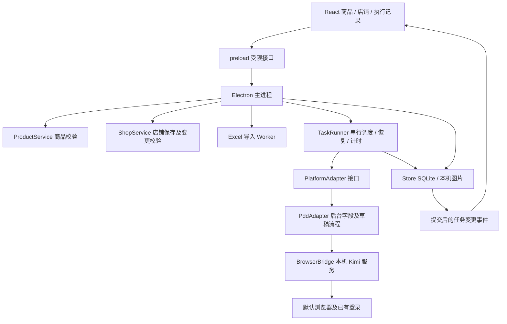

# 商品运营台技术选型与架构

更新：2026-10-04，源码版本 0.1.14。采用 **React + TypeScript + Electron + 确定性任务执行器 + 拼多多适配器 + 异常恢复 Agent**。不引入 LangGraph；模型使用可配置的 OpenAI 兼容 Chat Completions 接口。运营已配置云端模型，真实连接通过，异常恢复闭环仍待验收。

## 运营主流程

上传 Excel／选择文件夹 → 弹窗核对并保存商品 → 选择已保存店铺 → 默认浏览器登录及核对店铺 → 填写商品 → 保存后台草稿 → 读回字段及草稿状态 → App 回显。

单个 Excel 包含商品资料、规格清单和内嵌图片。店铺在 App 中选择；只提供草稿操作，无正式发布入口。

## 技术栈

| 部分 | 当前实现 |
| --- | --- |
| 界面及外壳 | React 19.3.0、TypeScript 5.9.3、自定义 CSS、Electron 44.4.0 |
| 解析 | Node Worker；ZIP/XML 读取 Excel、内嵌图片及 WPS DISPIMG |
| 数据 | sql.js 1.14.2 SQLite WASM；主进程写入，图片复制到资产目录 |
| 凭据 | safeStorage 异步系统加密，数据库保存密文 |
| 浏览器 | 系统默认浏览器 + Kimi 浏览器扩展及本机桥接服务 |
| 打包 | Vite 7.3.6、electron-builder 26.15.3、pnpm 锁定依赖 |

默认 Chrome 已执行真实草稿流程；扩展和桥接服务是外部前提，未包含在安装包中。其他默认浏览器、Windows 与 Intel Mac 尚未完成真机验证。

## 模块及进程

执行器是主进程中的异步模块，浏览器桥接为外部进程。Excel 解析在 Worker 线程，解析线程不写数据库。当前没有额外的自动化 Worker 或任务服务。

| 文件 | 职责 |
| --- | --- |
| `electron/main.ts` | 启动、窗口、文件选择、IPC、服务组装 |
| `electron/product-service.ts` | 商品清洗、资源引用及并发编辑校验 |
| `electron/shop-service.ts` | 店铺输入、重复账号、密码保存、执行中禁止改账号 |
| `electron/task-runner.ts` | 队列、快照、步骤、计时、恢复及错误分类 |
| `electron/execution.ts` | 平台接口、错误类型、核验项目、可选诊断接口 |
| `electron/platforms/pdd-adapter.ts` | PDD 字段、SKU、图片、保存及读回 |
| `electron/platforms/pdd-login.ts` | 任务登录、强制退出重登、验证码/密码错误分类及身份核对 |
| `src/ShopLogin.tsx` | 登录弹窗、分步耗时、人工验证后的身份核对 |
| `electron/browser-bridge.ts` | 本机桥接、控件操作、条件等待及图片传输 |
| `electron/store.ts` | SQLite 提交、原子替换、提交后任务事件 |
| `src/TaskRecords.tsx` | 进度、逐项核验、恢复入口、耗时与过程 |

主进程注入平台适配器。PDD 选择器不进入 React 或任务调度模块；当前只实现 PDD，不提前建设多平台插件系统。

## 调度与快照

- 正常工作空间只有一个浏览器队列，登录、切店、上传、保存和读回均串行。
- 创建任务时复制商品，记录店铺名称、账号、配置时间。执行前对照当前名称和账号，变化则停止。相同账号更新密码允许继续；配置时间保留作记录。
- 执行中的目标店铺不能编辑。未尝试保存时，运营可明确确认当前店铺配置；已尝试保存的任务禁止改绑，须恢复原账号回查。
- 本机商品变更不会自动改变旧任务。先编辑保存，再明确选择新版资料；已有编号时转入旧编号查询及重新开始。已尝试保存的任务禁止替换商品。
- 本机缺字段、图片或不完整规格矩阵，在分配编号前拦截，可结束当前商品并继续同批下一件。登录、页面、上传及保存不明先停止；可恢复页面异常经 Agent 处理后自动继续原任务与剩余批次。

## 状态、断点与恢复

状态为 `prepared`、`running`、`awaiting_user`、`failed`、`uncertain`、`succeeded`。步骤保存稳定 ID、运行／完成标记、次数及起止时间。重启把未结束耗时标为中断，任务不自动重放。

| 停止位置 | 恢复动作 |
| --- | --- |
| 尚未分配编号 | 检查账号、商品和图片后执行 |
| 原填写页有效 | 核对 URL 编号和类目，沿用原页重新核对填写，不分配新编号 |
| 原页失效／规格结构不匹配 | 明确确认重新开始，先按旧编号查草稿 |
| 原页已有图片 | 地址、顺序、数量与本任务上传记录完整匹配才沿用，否则提示处理 |
| 已写入保存意图 | 只读回原编号及草稿状态，不再点击保存或创建编号 |
| 旧编号新查询结果无法确认 | 停止，不能凭缓存空列表重建 |

重新开始时，旧编号已保存则转读回；确认未保存才记录旧编号并创建新填写页。恢复按实际页面重核字段，不宣称每个 DOM 操作都可精准续写。

保存意图在点击按钮前持久化。点击或回包失败保持结果不确定，按原编号回查；本机写入失败时停止执行。此机制降低重复创建风险，不是平台事务或严格 exactly-once 保证。

## 核验及界面事件

分别记录店铺、标题、类目、品牌可选项、类目属性、SKU组合／价格／库存／编码、轮播及详情图数量、参考价／折扣、发货、运费、售后。保存结果、依据、时间及填写／读回阶段；未到达保持待核验，不适用单独标记。

品牌可选项匹配不代表资质通过，品牌资质和最终发布审核持续标为未执行。图片读回核验为数量，原页恢复另校验地址及顺序；未实施保存后图片摘要或规格图内容核验。

成功需重新打开保存编辑页字段匹配，并在草稿箱按 ID 查到唯一编辑中记录；保留截图、编号、店铺、标题与时间。

SQLite 提交后推送单条任务事件，不传商品快照。首次加载及业务保存仍读取工作空间；修订号防止旧 IPC 返回覆盖新事件。每秒仅更新界面计时，不再每秒读取完整资料库。

数据库为主进程单写入，原子替换失败回滚事务。新字段为任务 JSON 可选项，旧任务可读；旧版 PASS 不作为新版运行证明。

## AI 与凭据

`AgentService` 在脚本已停止后接入：TaskRunner 释放浏览器队列 → 检查异常类型和模型配置 → 自动采集原商品页 → 模型决定是否调用受限恢复工具 → 记录操作与重新读取现场 → 校验输出 → 原编号继续 / 原草稿回查 → 原批次剩余商品继续。正常任务、Excel 本机错误、人工暂停不调用模型；未配置模型也可执行普通脚本。

自动恢复默认开启，可在模型设置关闭。白名单工具为 `read_task_facts`、`read_form_fields` 和 `dismiss_notice`、`wait_form_ready`、`restore_original_form`、`wait_uploads`。工具均不接收任意脚本或选择器。自动处理最多五轮模型请求、六次工具调用、约 120 秒；每任务最多自动交回脚本一次，仍失败则停止。手动诊断保持只读、最多三轮、两次工具调用，约 90 秒。

页面恢复核对实际店铺、账号和原编号；普通通知只能点唯一安全的关闭按钮，不能确认业务弹窗。重开使用已记录的原 URL，上传未确认禁止刷新。图片恢复要求本任务原编号及完整提交清单，等待数量匹配后保存地址/顺序记录，脚本继续时复核。已尝试保存时不提供这些恢复工具，后续仅回查原草稿，不能重复保存或创建编号。编号缺失时不能自动分配新编号。

模型收到精选商品字段、价格库存、承诺及异常核验结果；页面读取开启时，附带原页标题、属性、已显示选项、错误与弹窗标题/按钮名称。账号密码、Cookie、图片、文件路径、完整页面和整段日志不发送。页面不可读时明确说明限制。

模型不能修改 Excel、价格、库存、账号或发布。资料问题应具体指出字段，由运营编辑保存并更新任务。验证码、权限验证及现有工具无法解决的页面变化保留现场。结果包含模型、实际接口、来源、tokens（接口提供时）、独立耗时、恢复操作及任务指纹；任务改变后拒绝使用旧建议。模型接入不等于所有页面变化都已具备自动修复能力。

暂不需要 LangGraph 调度和持久化，继续使用现有 SQLite 状态和 TaskRunner。任务执行器只依赖异常回调，模型依赖不进入商品正常填表链。

safeStorage 保存店铺密码及模型 Key 密文，普通 IPC 不返回已保存的密码或 Key；模型凭据只在主进程请求时短暂解密。不可用不回退明文。模型 Key 与接口地址绑定，变更地址不沿用旧 Key；连接验证只发送一条验证文本。云端要求 HTTPS，本机 loopback 可用 HTTP；模型请求不跟随重定向，响应有大小和超时限制，服务商错误正文不直接显示。验证码由运营完成。界面开启上下文隔离与沙箱，关闭 Node 集成，仅开放业务接口。

使用默认浏览器已有登录，不创建第二个 Chrome 用户目录。人工切页或切店会使恢复检查停止。多开隔离数据目录仅用于开发，不能同时操作同一桥接会话。

## 交付边界

Mac Apple Silicon 为内部临时签名包；Developer ID、公证及其他电脑安装验收未完成。Windows 构建配置保留，安装、凭据及默认浏览器桥接须真机验证；Intel Mac 未构建。

任务执行的历史实测见 `项目文档/15任务框架完善0.1.11.md`；异常恢复实现与验证边界见 `项目文档/17异常自动接入与恢复0.1.13.md`。0.1.13 后续新建真实草稿 1012550849314，未触发 Agent。0.1.14 本轮仅补齐登录实现与本机桌面入口，未执行真实退出重登，也未新建或发布后台商品。
